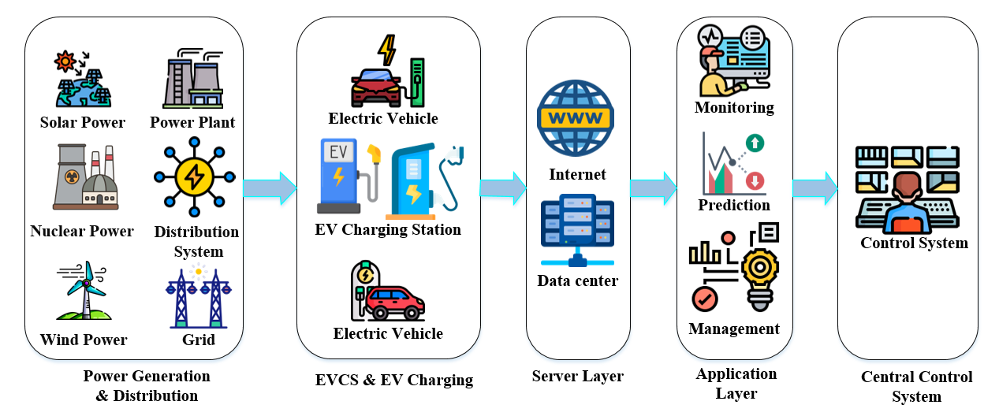

# Secure-EVCS-demand-forecasting-under-adversarial-and-false-data-injection-attacks
This repository contains code and data for forecasting EV charging demand, testing model performance under cyber-attacks (FGSM, BIM, scaling FDI), and applying adversarial training to improve resilience and accuracy. **The code will be published after the paper is accepted for publication.**
# Overview 

## **Dataset**  
 The data utilized in this research originates from Palo Alto, a city located in the United States of America (USA), [Available](https://github.com/Najmul1801098/Secure-EVCS-demand-forecasting-under-adversarial-and-false-data-injection-attacks/tree/b16f809997060d82e95bb57be0097cb357c1d8b9/Dataset)
  

## **Citation**  
If you use this work, please cite: 

## **Installation & Usage**  
1. **Clone the Repository:**  
   
bash
   git clone https://github.com/your-username/your-repository.git
   cd your-repository in this add table of contents
