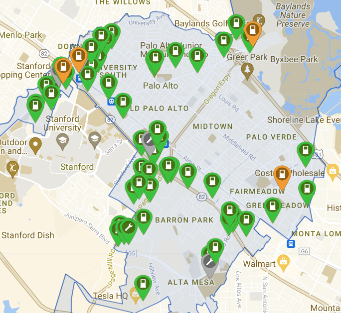

# Secure-EVCS-demand-forecasting-under-adversarial-and-false-data-injection-attacks
The purpose of this repository is to provide code and data for forecasting electric vehicle (EV) charging demand, evaluating model performance under cyber-attacks (including FGSM, BIM, and scaling FDI), and implementing adversarial training to enhance resilience and accuracy. The manuscript titled "Secure Electric Vehicle Charging Station Demand Forecasting under Adversarial and False Data Injection Attacks," which is based on this project, is currently under review. Therefore, only the dataset and a few images are available at this time. **The code and trained models will be published once the paper has been accepted for publication.**

## **Dataset**  
 The data utilized in this research originates from Palo Alto, a city located in the United States of America (USA), [Available](https://github.com/Najmul1801098/Secure-EVCS-demand-forecasting-under-adversarial-and-false-data-injection-attacks/tree/b16f809997060d82e95bb57be0097cb357c1d8b9/Dataset)

  

## **Installation**  

This code is compatible with Python 3.8+ and uses the following main dependencies:

- **Pandas** version 1.5.3  
- **NumPy** version 1.24.3  
- **Matplotlib** version 3.7.1  
- **Seaborn** version 0.12.2  
- **Scikit-learn** version 1.2.2  
- **CatBoost** version 1.2.4  
- **Keras** version 2.12.0  
- **TensorFlow** version 2.12.0 (for Keras backend) 
The remainder of the dependencies are standard Python packages and may come pre-installed with distributions like Anaconda.

1. **Clone the Repository:**  
   
bash
   git clone https://github.com/your-username/your-repository.git
   cd your-repository in this add table of contents
